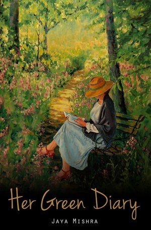

<figure>
  
</figure>
 
## Her Green Diary

This book is a collection of a few poems I wrote when I was in school.
I’ve talked about “Love”, “Loneliness”, and “Reality” in the book – the most common emotions and questions a young mind of a girl in her adolescence usually wander about. It talks about teenage crushes, first loves, heart breaks, identifying with the female gender in the society, its perks and disadvantages, and several other things.
  
“Some folded papers 
Lost in shelves, as is me, 
Among shiny slippers, silver plates, 
Among belaud words I don’t mean.” 
 
 
You can order your own paperback copy <a target="_blank" href="https://www.amazon.com/Her-Green-Diary-Jaya-Mishra/dp/1539078469/" >on Amazon</a>. 
Or, can find a <a target="_blank" href="https://www.amazon.com/Her-Green-Diary-Jaya-Mishra-ebook/dp/B01M0ABC35" >kindle edition</a>. 
Or, if you wish to read it for free, you can download the pdf copy <a href="assets/download/Kindle-Her Green Diary.pdf">here</a>. 
Hope you will enjoy it.
